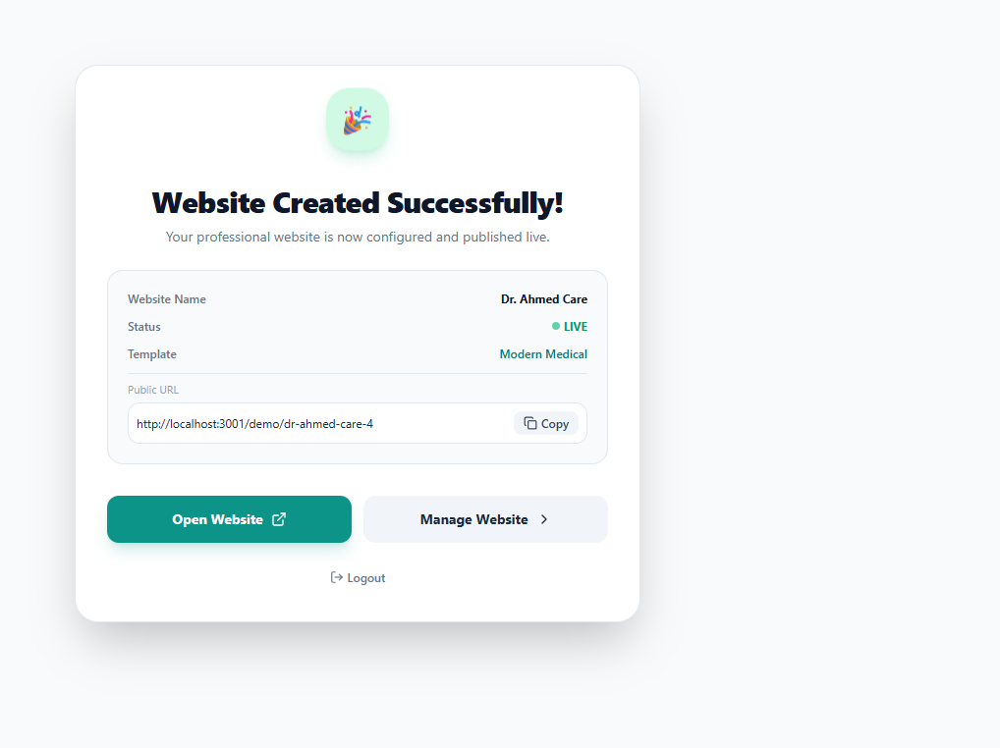

# 🏥 MediWeb - Healthcare & Doctor Website Builder Platform

[](https://nextjs.org/)
[](https://reactjs.org/)
[](https://www.typescriptlang.org/)
[](https://tailwindcss.com/)
[](https://developer.android.com/)
[](https://www.prisma.io/)
[](LICENSE)

**MediWeb** is a full-featured, modern SaaS platform designed specifically for doctors, clinics, and healthcare professionals to create, customize, and publish stunning, responsive medical websites and native Android APK packages in minutes without any coding.

---

## 📸 Platform Preview & UI

<div align="center">
  
  <p><em>Instant Website Creation, Live Publishing & One-Click Android APK Package Generator</em></p>
</div>

---

## ✨ Features

- 🩺 **Doctor & Clinic Website Builder**
  - Instant website creation with pre-built healthcare templates.
  - Full customization of doctor profiles, specializations, qualifications, bio, contact details, and clinic addresses.

- 📱 **One-Click Native Android APK Generator (`.apk`)**
  - Instant APK builder with real-time compilation progress & live terminal logs.
  - Automatic `AndroidManifest.xml` generation and permissions setup (Camera for Telehealth, Internet, Notifications).
  - Standalone release packaging with Release Keystore signing (v2/v3).
  - Direct browser `.apk` download and instant QR code for mobile camera installation.

- 🎨 **Dynamic Theme & Design Engine**
  - Live color palette customization (Primary, Secondary, Background, and Text colors).
  - Typography, button styling (Pill, Rounded, Square), and header layout configurations.
  - Template options including *Modern Medical*, *Professional Doctor*, and *Premium Clinic*.

- 📲 **Real-Time Responsive Multi-Device Preview**
  - Instant live preview inside the dashboard.
  - Toggle between Desktop (`Laptop`), Tablet (`Tablet`), and Mobile (`Smartphone`) viewport modes.
  - Interactive iOS and Android mobile app mockups with live appointment booking simulations.

- 📅 **Appointment Management**
  - Integrated patient booking system for online appointments.
  - Appointment management dashboard with status tracking (Confirmed, Pending, Completed).

- 💉 **Services & Treatment Catalog**
  - Add, edit, reorder, and remove medical services with custom pricing, duration, description, and medical icons.

- 🖼️ **Media & Clinic Gallery**
  - Upload and manage clinic photos, doctor profiles, logos, and hero cover images.

- ⚡ **High Performance & SEO Optimized**
  - Built with Next.js 14 App Router for fast server rendering and optimal Core Web Vitals.
  - Clean semantic markup and structured metadata.

---

## 🛠️ Tech Stack

- **Framework**: [Next.js 14 (App Router)](https://nextjs.org/)
- **Frontend**: [React 18](https://reactjs.org/) & [TypeScript](https://www.typescriptlang.org/)
- **Mobile & APK Engine**: [Capacitor](https://capacitorjs.com/) (Android Bridge & Native Package Compiler)
- **Styling**: [Tailwind CSS](https://tailwindcss.com/) & [PostCSS](https://postcss.org/)
- **Icons**: [Lucide React](https://lucide.dev/)
- **Database & ORM**: [Prisma ORM](https://www.prisma.io/) with SQLite (configurable for PostgreSQL/MySQL)
- **Utilities**: `clsx`, `tailwind-merge`

---

## 📂 Project Structure

```text
├── android/                # Capacitor Android native project & Gradle build configuration
├── prisma/
│   ├── schema.prisma       # Database models (User, Website, Profile, Service, Design, Gallery)
│   ├── seed.js             # Database seeding script
│   └── dev.db              # Local SQLite database
├── public/
│   └── screenshots/        # UI screenshots and platform preview images
├── src/
│   ├── app/
│   │   ├── api/
│   │   │   ├── generate-apk/ # Native Android APK compilation & download endpoint
│   │   │   └── websites/     # Website REST APIs (CRUD, slugs, appointments)
│   │   ├── dashboard/        # Doctor dashboard, website manager, customizer & live preview
│   │   ├── demo/             # Template demo showcase
│   │   ├── login/            # User authentication (Login)
│   │   ├── signup/           # User authentication (Signup)
│   │   ├── globals.css       # Global styles and Tailwind directives
│   │   ├── layout.tsx        # Root application layout
│   │   └── page.tsx          # Landing page & hero presentation
│   ├── components/
│   │   ├── APKGeneratorModal.tsx # Standalone Android APK generator & QR scanner modal
│   │   └── renderer/         # Dynamic website rendering engine & mobile mockups
│   └── lib/                  # Shared utilities, types, and database clients
├── tailwind.config.ts        # Tailwind CSS configuration
├── tsconfig.json             # TypeScript configuration
└── package.json              # Dependencies and scripts
```

---

## 🚀 Getting Started

### 1. Prerequisites

Ensure you have the following installed:
- [Node.js](https://nodejs.org/) (version 18.17 or higher recommended)
- [npm](https://www.npmjs.com/) or [yarn](https://yarnpkg.com/) or [pnpm](https://pnpm.io/)
- [Git](https://git-scm.com/)

### 2. Clone the Repository

```bash
git clone https://github.com/alam292/MediWeb.git
cd MediWeb
```

### 3. Install Dependencies

```bash
npm install
```

### 4. Database Setup

Generate the Prisma client and run seed data:

```bash
npx prisma generate
npx prisma db push
npm run seed
```

### 5. Start Development Server

```bash
npm run dev
```

Open [http://localhost:3000](http://localhost:3000) in your browser to view the application.

---

## 📜 Available Scripts

| Command | Description |
| :--- | :--- |
| `npm run dev` | Starts the development server at `localhost:3000` |
| `npm run build` | Builds the optimized production application |
| `npm run start` | Runs the compiled production build |
| `npm run seed` | Seeds the database with default doctor websites and demo data |

---

## 🔒 Environment Configuration

Create a `.env` file in the root directory if you wish to configure custom environment variables:

```env
DATABASE_URL="file:./dev.db"
NEXT_PUBLIC_APP_URL="http://localhost:3000"
```

---

## 🤝 Contributing

Contributions, issues, and feature requests are welcome! Feel free to check the [issues page](https://github.com/alam292/MediWeb/issues).

1. Fork the Project
2. Create your Feature Branch (`git checkout -b feature/AmazingFeature`)
3. Commit your Changes (`git commit -m 'Add some AmazingFeature'`)
4. Push to the Branch (`git push origin feature/AmazingFeature`)
5. Open a Pull Request

---

## 📄 License

This project is open source and available under the [MIT License](LICENSE).
